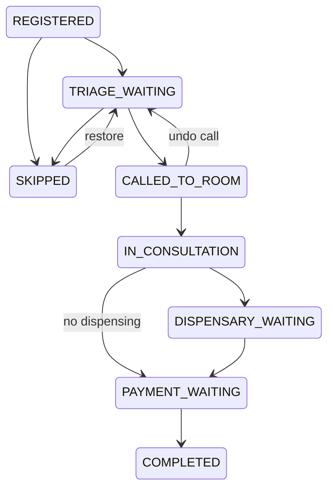
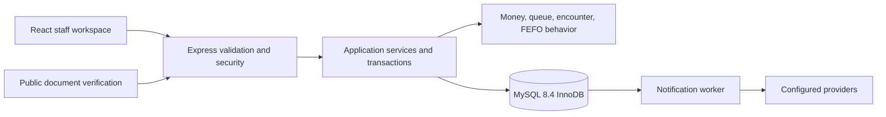

# Clinic Management System V2 — System Specification

## 1. Scope and authority

This specification describes the implemented GP clinic application replacing the earlier V1 demonstration.
It incorporates the user's current requirements rather than preserving superseded PostgreSQL, UUID or specialty-workflow proposals as active scope.

The required platform is MySQL 8.4/InnoDB, TypeScript, React and a modular Express backend.
All 26 entity tables use unsigned auto-increment numeric primary keys and matching numeric foreign keys after migrations 001–017.
Session secrets, document verification tokens and idempotency keys remain opaque strings; they are not entity identifiers.

Executable migrations and validators are authoritative for exact column types and bounds.
This document records required behavior, delivered boundaries and remaining integration work.
See [requirement traceability](docs/REQUIREMENTS.md) for implementation evidence.

## 2. Users, permissions and branches

| Role | Default modules |
| --- | --- |
| ADMIN | All seven operational modules and administration |
| DOCTOR, displayed as GP | Queue, patients, appointments, clinical, inventory |
| RECEPTIONIST | Queue, patients, appointments, billing, reports |
| NURSE | Queue, patients, inventory |
| THERAPIST | Queue, patients, appointments; retained account role without a specialty treatment workflow |

Administrators configure tenant-wide non-administrator role grants for `queue`, `patients`, `appointments`, `clinical`, `inventory`, `billing` and `reports`.
The server evaluates grants on every authenticated request. Navigation and direct screen access follow effective grants.
Account security and the user guide remain available to all staff. Administrator access cannot be removed through the matrix.

The user guide includes optional interactive walkthroughs that circle actual controls and explain their functions.
Tours respect effective module access and never submit clinical or administrative records.
Navigation, forms and guide controls support phone screens; walkthrough instructions remain within the viewport.

Module access enables ordinary operations, including billing for a nurse granted that module.
Only `DOCTOR` can create, edit or sign consultations and issue clinical documents.
An administrator can review records but cannot acquire GP authority through module grants.
Document revocation requires the issuing GP through the deployed API.

Each request resolves the authenticated tenant and an authorized selected branch.
Numeric IDs never substitute for ownership checks. Branch membership remains independent of module grants.
Active GP accounts assigned to a branch automatically populate practitioner selectors; a separate practitioner profile is unnecessary.
GP creation requires a professional registration number.

## 3. Patient registration and history

Registration stores first name, optional last name, derived display name, nationality, IC/passport number, birth date and sex.
Non-Malaysian registration/editing requires country of nationality in the UI. Nullable ISO countryCode is separate from phone calling code and address. Malaysian patients derive MY; historical foreign countries remain unknown. Legacy API callers may omit country; ordinary updates preserve omitted existing country.
Single legal names are supported. Contact, blood group, allergies, chronic conditions and notification consent are recorded explicitly.
Address fields are line 1, line 2, postcode, city and state.

Malaysian IC entry accepts 12 digits and formats `YYMMDD-SS-NNNN`.
Valid calendar digits derive birth date; final-digit parity derives male or female.
The two-digit year permits an older-century correction matching the IC date digits.
These checks validate structure and consistency; they do not verify identity with a government registry.
Non-Malaysian registration requires passport number and manually reviewed birth date/sex.

A bundled offline five-digit Malaysian postcode lookup assists city/state entry.
Unique compatible matches fill missing fields. Multiple localities require a choice; unknown codes allow manual entry.
Existing custom address values and manual overrides are preserved. Non-Malaysian addresses bypass automatic lookup.

National identity numbers are unique within a tenant. Patients and ordinary registry reads remain branch scoped.
Edits require the current optimistic version. Patient ID is the numeric database record ID, distinct from identity-document numbers.
Clinical history is patient scoped and cursor paged in batches of 50; it never infers complete history from a global recent-record list.

## 4. Appointments and queue

Appointments select a searched patient, active GP, optional active room, start/end times and reason.
Transactional locks reject overlapping practitioner or room bookings. Adjacent intervals are permitted.
The API supports versioned booking cancellation; the current booking screen does not expose a cancellation control.

Queue check-in creates a branch/service-date ticket and rejects duplicate active visits.
State transitions follow the server domain model:

Every transition uses the current version. Calling assigns an active room and GP; occupied rooms cannot be double booked.
SSE refresh events and periodic reads keep the workspace current. SSE fanout is process local.
The waiting-room screen requires staff authentication and displays only ticket numbers and rooms.
Queue-clearance estimates require at least five qualifying recent consultation observations and remain explicitly approximate.

## 5. GP consultation and prescribing

The clinical workspace records subjective history, objective findings, assessment, plan, vitals and procedure notes.
SOAP fields appear on separate full-width rows. Patient and prescription lists expose visible search controls.
Blood pressure uses positive whole-number `SYS/DIA`, with systolic greater than diastolic; malformed entries are rejected.
Readings outside the reference monitor limits (SYS 60–260, DIA 40–215 mmHg) trigger a warning and remain recordable.
These limits flag data for review; they are not a healthy range or diagnosis.
Allergies and conditions are visible before prescribing. The application does not generate diagnoses or medication decisions.
Drafts are editable by their attending GP with optimistic versions. Signed encounters are immutable.

Each prescription records catalog medicine ID, total quantity, dosage instructions, frequency per day, meal timing and supply days.
Frequency is an integer from 1 through 24. Meal timing is `BEFORE_MEAL`, `AFTER_MEAL` or `ANY_TIME`.
Existing prescriptions and vitals are preserved when editing a draft.
Medication selectors use a minimal reference API so clinical access does not require broad inventory access.

## 6. Inventory and dispensary

Catalog items store SKU, name, ingredient, category, unit, price in cents and reorder level.
Creating an item does not create stock. Batch receipt records batch number, expiry, quantity and a movement ledger entry.
The catalog supports medications, consumables and retail supplies such as lab coats.
Medication expiry is mandatory; non-medication batches may have no expiry.
Non-medication usage records item, quantity, reason and staff member with an idempotent movement ledger; it cannot bypass medication dispensing.

Signing a prescription reserves eligible batches atomically and reduces available stock immediately; drafts reserve nothing.
Insufficient free stock aborts signing without saving a signed encounter or partial holds.
`stockQuantity` is available stock; `onHandQuantity` is eligible unexpired physical stock; `reservedQuantity` is active eligible prescription holds.

Pending work includes only branch-scoped signed encounters containing prescriptions that have not already been dispensed.
Prescription activity logs show clinic prescribing, stock reservation and dispensing history with quantities, batches, staff and timestamps.
These logs do not establish whether a patient took a dose.
Clinical staff can separately record patient medication-taking events, distinguishing patient reports from staff observations.
Taking or missing a dose never deducts clinic stock again; the dispensing ledger remains the inventory boundary.
The dispensary projection includes medicine instructions and allergies but excludes full SOAP notes.
FEFO consumes the earliest eligible expiry first. Expiry on or before the clinic date is ineligible; undated supplies sort after dated batches.
Dispensing releases its own holds and allocates eligible stock excluding other prescriptions' holds, then deducts physical units once.
Expired reserved batches can be replaced with fresh eligible stock during dispensing; failed allocation restores prior holds and quantities.
Historical signed encounters without holds remain dispensable from free stock. Existing records are not backfilled or reset.
All prescribed quantities are allocated atomically; insufficient stock leaves the whole dispense unchanged.
Idempotency keys and unique encounter dispensing prevent duplicate depletion.
Stock totals and pending work refresh after successful actions.

## 7. Billing

Checkout stores itemized invoice snapshots and split cash, card, QR or deposit tender records in one transaction.
All monetary values use integer MYR cents. Positive tender amounts must exactly equal the invoice total.
Deposit spending locks the patient balance and rejects overspending. Invoice retries reuse the original idempotency key.
The same key with a changed financial payload returns a conflict.

Receipts are generated from persisted invoices and payments. Card/QR records declare received tender; gateway authorization is not integrated.
Current GP checkout does not generate commission ledger entries.
Refunds, fiscal e-invoice integration and automated settlement reconciliation are separate future requirements.

## 8. Clinical documents

The attending GP issues MC, referral and laboratory documents from signed consultations.
The MC form defaults leave start using Malaysia time: before 17:00 uses today; 17:00 onward uses tomorrow.
Staff can override the default date. Draft or other-practitioner encounters show an eligibility explanation before issuance.
Documents retain payload snapshots, document numbers, a signing HMAC and hashed public verification tokens.
PDF generation includes verification QR codes. Public verification returns minimal authenticity metadata without patient names or diagnoses.
Document actions open an authenticated in-page preview before any explicit PDF download.
MC layout follows a centered clinic letterhead, ruled patient/leave fields, practitioner block and issue-time/reference footer.
Clinic and practitioner details come from the issued snapshot; reference-image branding and handwritten signatures are not copied.

MCs use inclusive date ranges, prevent overlapping active periods and support diagnosis redaction and light-duty details.
Referral data includes target, urgency, reason and clinical context. Laboratory requests capture panels, specimen and fasting details.
Revocation records a reason and audit entry. Corrections require revocation and replacement rather than overwriting issued payloads.
Automatic MC extension and shortcut-driven issuance are not delivered workflows.

## 9. Notifications

Consent-based transactional outbox records support booking messages with calendar/maps information, queue calls, queue-near alerts and refill reminders.
A separate worker sends through configured email or WhatsApp adapters.
States distinguish `PENDING`, `PROCESSING`, `SENT`, `FAILED` and `UNCONFIGURED`.
`SENT` means provider acceptance, not proof of patient delivery or reading.
Administrators can retry eligible failed/unconfigured records. Provider credentials and message-template approvals are deployment prerequisites.

## 10. Administration

Administrators create branches and staff, toggle staff activity, manage rooms, inspect audit records and save role module grants.
Self-deactivation and loss of the final administrator are protected.
Room rename/archive operations reject active occupancy and future bookings. Archived rooms preserve historical references and disappear from active selectors.
Staff password changes require the current password and 14–128 character new passwords; session invalidation requires signing in again.

## 11. Architecture and schema

The modular monolith separates browser components, HTTP adapters, services, domain behavior and database adapters.
It uses OOP where behavior needs invariants rather than adding empty entity wrappers.
Shared identity, module and identifier contracts reduce duplicated validation.
Reusable UI forms and minimal reference endpoints support independent module grants.

The final schema has 26 entity tables, composite membership/policy keys, secret-keyed sessions and resource locks.
Unsigned numeric keys support long-term growth, while API inputs remain within JavaScript's positive safe-integer range.
Composite foreign keys enforce tenant/branch relationships; generated queue keys protect active-patient and room uniqueness.
JSON captures prescriptions, vitals and immutable snapshots; typed references inside JSON require application validation.
See [database dictionary](docs/DATABASE.md), [ERD](docs/ERD.md), [architecture](docs/ARCHITECTURE.md) and [system flow](docs/SYSTEM_FLOW.md).

## 12. Security and operational requirements

Authentication uses server sessions, hashed session tokens, password hashing and an HttpOnly SameSite cookie.
State changes require CSRF tokens; supplied origins are checked. Input schemas reject unexpected mutation fields.
Queries bind parameters. Role/module and tenant/branch checks occur server side. Responses do not cache clinical API records.
Security headers, rate limits, optimistic concurrency and audit entries provide implemented controls.

Production requires HTTPS, restricted database access, protected keys, verified backups/restoration and provider configuration.
Clinical and financial retention rules require operator policy. The repository does not establish regulatory certification.
Use [prerequisites](docs/PREREQUISITES.md) and the repository deployment/security documents before deployment.

## 13. Verification and exclusions

Acceptance includes fresh migration/bootstrap, authenticated branch access, cross-branch denial, IC/postcode registration, module-only workflows, GP signing, FEFO rollback, retry-safe billing and private document verification.
Concurrency cases cover booking overlaps, occupied rooms, stale versions, stock depletion and deposit overspending.
Upgrade tests must preserve historical document integrity and foreign keys while converting actual numeric keys.
See [test documentation](docs/TESTING.md) for executable checks and recorded limitations.

Retired features are treatment packages, commissions, payroll exports and clinical photos. Deployed paths reject them with `410 FEATURE_RETIRED`.
Historical storage and migration code remain intentionally retained; their existence does not advertise active product functionality.
Dental/aesthetic workflows, online patient portals, OCR/hardware, insurance claims, payment gateways and third-party EMR integrations need separate approved specifications.
V1 external data import requires a known source schema, validated mapping and rehearsed rollback; generic compatibility is not promised.

## 14. Separate browser demo mode

The free-hosting demonstration build is explicitly separate from the MySQL application.
`VITE_DEMO_MODE` equal to the string `true` selects a browser-only transport backed by tab-scoped `sessionStorage`.
The banner labels sample data and tab-session persistence. Login shows demo-only accounts; Reset demo clears only its storage namespace.
Fictitious patient, appointment, queue, prescription, stock and billing fixtures belong only to `DemoClinic`.
Reset restores the initial demo examples. Real MySQL bootstrap creates clinic/staff/room setup without patient or business fixtures.
The explicit development seed command remains guarded and is not invoked by normal bootstrap or demo startup.
Normal application builds continue to use authenticated HTTP requests and MySQL without this transport.

Demo account switching illustrates screens and role grants; it is not server authentication or an authorization boundary.
Demo operations simulate workflows without actual database transactions, external messages, payment authorization or cryptographically issued documents.
Receipt samples preview in-page; PDF downloads remain unavailable. Live SSE is disabled; local refresh reads browser state.
The demo must contain sample data only. Browser session restoration may retain tab storage; explicit reset clears it.
No real patient information, provider secrets or database credentials belong in its bundle.

## Administrator-managed catalog choices

Administrators edit drugs, supplies, rooms, lab panels, specimen types, inventory units and referral destinations. Choices are branch scoped and can be archived/restored. New prescribing uses active medication items. Used item categories, ingredients and units stay fixed. New signed prescriptions retain authoritative medicine snapshots; legacy records without snapshots use catalog fallback. Existing signed prescriptions remain dispensable after archival. Workflow statuses and role codes remain fixed application rules.

Patient phone numbers accept Malaysian and foreign formatting, including country codes, up to 50 characters.
Registration and demographic editing provide a phone country-code dropdown, defaulting to Malaysia (+60). Unlisted countries support full international entry. Pasted international numbers avoid duplicated prefixes. Unedited stored contacts remain unchanged; schema and API continue using the existing phone string.

## Task sections and scrolling

Operational modules separate lists, entry forms and history into named sections. Section navigation stays available while scrolling and wraps on phones. Only the selected task area is visible. Switching sections within a module retains unsaved form values; successful registration, booking, checkout and check-in clear completed forms as before. Leaving a module or reloading is not a draft-save operation. Patient/allergy context remains outside clinical task sections. Guided walkthroughs open the section containing the highlighted control. Single-task password and notification screens remain focused.

## Settings lifecycle and receipts

Administrators edit staff names and branch name/address. Settings lists expose Remove and Restore, hiding removed entries by default with Show removed controls. Room removal deletes unreferenced rooms and archives historical rooms; busy rooms and upcoming bookings block removal. Branch removal archives, preserving history; selected branch, final active branch and active staff home assignments are protected. Restoring staff access requires an active home branch. Catalog and inventory removal archives choices; used stock identity rules remain unchanged. Role/status codes remain fixed domain rules.

Receipt preview uses clinic/branch header, patient name and IC/passport, receipt/date, itemized quantities/prices/amounts, total, recorded payment breakdown, cashier and MYT issue time. No copied logo, registration number, tax or discount is invented. New invoices capture immutable receipt metadata; existing invoices use current records and checkout audit fallback. Browser demo previews are labeled sample receipts and do not provide real PDF/payment verification.

## Current workflow refinements

Patients and appointment patient choices default to numeric patient ID; stock items default to item ID. Patient rows open complete profiles, including contacts and address. Nationality country controls occupy a fixed form position; selected phone calling codes appear inside the number field. Appointment dates must be today or future in Malaysia time. Booked/cancelled appointments support audited soft removal; attended appointments remain protected. Clinical lists group loaded matching encounters by patient, with separately loaded paginated history and explicit record selection. New consultation is a separate creation section; record tools remain disabled until selection. Ingredient is mandatory for medicines and optional for supplies/retail. Administrators rename the clinic through Clinic settings; future receipt snapshots use the new name. Reports & delivery navigation is retired; underlying notification history and compatibility grants remain. User guide labels and circles actual tabs and functions.

## Patient-first interaction revision

Tasks use one section-tab entry point: Clinic overview → Check in patient; Patients → Patient registration; Billing → Patient checkout or Patient deposits. Header duplicates are removed; submit buttons still commit the entered form. Clinical workspace starts at Choose patient: search/select → Patient history → Open consultation, or New consultation for the selected patient. Changing patient clears previous record tools. Catalogue rows show concise stock summaries; View details expands metadata, batches and administrator actions. Filter and sort loaded stock reveals advanced controls; Default: Item ID supports both directions. Practitioner registration number is shown and required only for GP/DOCTOR creation; other roles submit null. User guide remains in the header and is removed from the sidebar. All persistent form submissions except sign-in require popup consent. Queue transitions, removal/restoration and demo reset also require consent. Cancel/Escape keeps drafts without sending the mutation. Clinical signing explicitly explains permanent notes and stock reservation. This is a UI safeguard; server permissions, validation, transactions and auditing remain authoritative.
