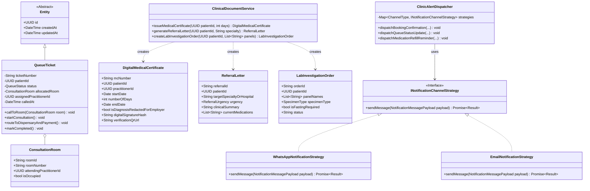

# CLINIC MANAGEMENT SYSTEM (CMS) - ENTERPRISE SPECIFICATION & ARCHITECTURE
**Benchmark**: Enterprise Clinical Management System | **UI Aesthetic**: Pastel Blue & Slate | **Standards**: OOP (SOLID/DDD) & Human-Computer Interaction (HCI)

---

## 1. EXECUTIVE OPERATIONAL CHARTER & COO BRIEF

### 1.1 Objective & System Scope
Cloud-native enterprise **Clinic Management System (CMS)** designed for multi-branch general practices, specialized outpatient centers, dental clinics, and aesthetic medical centers.

The system automates core clinic operations across four operational pillars:
1. **Intake, Queue & Scheduling**: Real-time queue tracking, consultation room allocation displays, multi-channel automated WhatsApp/email alert pipelines (bookings, live queue bumps, post-visit medication refills).
2. **Clinical EMR & Documentation**: SOAP consultation charting, procedure notes, before/after photo comparison, and digital issuance of **Medical Certificates (MC)**, **Referral Letters**, and **Lab Investigation Requisitions**.
3. **Treatment Packages & Dispensary Inventory**: Prepaid session punch cards, session sign-offs, and pharmacy inventory managed via **First-Expiry-First-Out (FEFO)** batch depletion.
4. **POS Billing & Practitioner Commissions**: Multi-rail split payments, patient deposits, and tiered commission ledgers for doctors and therapists.

> [!NOTE]
> **Operational Scope Note**: The system is dedicated exclusively to operational clinical administration, outpatient EMR charting, treatment packages, POS billing, and dispensary inventory. It has no dependency on medical scanning apparatus or external laboratory scan OCR engines.

---

## 2. BENCHMARK ANALYSIS: CLINICAL SYSTEM PARITY MATRIX

| Core Operational Feature | CMS Architecture Solution | Operational Value |
| :--- | :--- | :--- |
| **Real-Time Queue & Room Allocation** | Aggregate Root `QueueTicket` + WebSocket Room Dispatch Engine | Dynamic waiting room TV board; live mobile queue position |
| **Automated Patient Alerting** | Observer & Strategy Pattern `ClinicAlertDispatcher` (WhatsApp & Email) | Zero-friction booking confirmations, queue bump alerts, proactive 3-day refill reminders |
| **Digital Clinical Documents** | Domain Service `ClinicalDocumentService` issuing QR-verified MCs, referral letters, and lab requisitions | 1-click generation from SOAP chart; employer QR verification portal |
| **Cloud EMR & Clinical Charting** | Encapsulated Domain Aggregate `ClinicalEncounter` with specialized SOAP templates (GP, Aesthetic, Dental) | Sub-second chart loading; allergy conflict prevention |
| **Treatment Packages & Prepaid Credits** | Aggregate Root `TreatmentPackage` with session redemption invariants & expiry enforcement | Eliminates manual package balance errors; real-time session sign-off |
| **Multi-Doctor Appointment Scheduler** | Reactive calendar engine with optimistic locking and multi-room assignment | Eliminates double-booking; syncs directly to WhatsApp notifications |
| **Pharmacy & Consumable Inventory** | Domain Entity `InventoryItem` with automated FEFO (First-Expiry-First-Out) batch depletion | Prevents dispensing expired stock; automatic par-level reorder alerts |
| **Point of Sale (POS) & Billing** | Strategy Pattern `IPaymentStrategy` supporting Split Payments (Cash, Card, QR, Package Redemptions) | Fast checkout; automated receipt generation and deposit handling |
| **Doctor & Therapist Commission Ledger** | Domain Service `CommissionCalculator` supporting tiered service and retail product splits | Full revenue attribution transparency; automated month-end payroll sync |

---

## 3. HUMAN-COMPUTER INTERACTION (HCI) DESIGN SPECIFICATION

### 3.1 Cognitive Ergonomics & Persona Flows
Clinical environments impose high cognitive load. System ergonomics optimize four distinct user touchpoints:

```
┌────────────────────────────────────────────────────────────────────────┐
│                   HCI CLINICAL PERSONA ERGONOMICS                      │
├─────────────────────┬──────────────────────────────────────────────────┤
│ 1. Waiting Patient  │ Glanceable TV display + mobile WhatsApp progress │
│ 2. Front Desk Staff │ Rapid queue check-in & automated booking dispatch│
│ 3. Attending Doctor │ 1-click Digital MC issuance & room call button   │
│ 4. Dispensary Nurse │ Automated refill reminder trigger & FEFO verify  │
└─────────────────────┴──────────────────────────────────────────────────┘
```

#### 3.1.1 Nielsen's 10 Usability Heuristics Applied
1. **Visibility of System Status**: 
   - **Live Queue Room Display**: High-contrast, glanceable public monitor (`Ticket Q-104` ➔ `Room 02 - Dr. Tan`) with subtle audio chime.
   - **WhatsApp Live Queue Indicator**: Real-time progress updates delivered to patient phone ("2 patients ahead of you; estimated wait: 15 mins").
2. **Match Between System and Real World**: 
   - Clinical documents follow Malaysian clinic workflows and include QR verification references.
   - Package tracking displays intuitive punch-card visual meters (`[●][●][●][○][○]`).
3. **User Control and Freedom**: 
   - Doctors can revoke, reissue, or extend Digital MCs with audited remarks.
   - 1-click "Undo" on queue skip or incorrect room re-allocation.
4. **Consistency and Standards**: 
   - Pinned patient banner across all views (Name, NRIC, Age, Blood Group, Allergy Badge).
   - Uniform status colors (Blue = Active, Mint = Completed, Amber = Waiting, Red = Urgent/Alert).
5. **Error Prevention**: 
   - **Duplicate MC Prevention**: Prevents issuing overlapping sick leave periods for the same patient.
   - **Allergy Collision Shield**: Impassable modal warning if a prescribed item matches patient allergies.
   - **FEFO Dispense Shield**: System refuses checkout scan if batch is expired.
6. **Recognition Rather Than Recall**: 
   - Digital MC and referral letters auto-populate patient demographics, doctor license, and diagnosis directly from the current consultation SOAP note.
   - Employer privacy toggle: 1-click option to redact diagnosis on employer-facing MC while retaining clinical code for medical records.
7. **Flexibility and Efficiency of Use**: 
   - **Doctor Quick-MC Buttons**: One-tap presets for sick leave duration (`[1 Day]`, `[2 Days]`, `[3 Days]`, `[Custom]`).
   - Global keyboard shortcuts (`Cmd+K` global search, `Cmd+M` issue MC, `Cmd+R` referral).
8. **Aesthetic and Minimalist Design**: 
   - Pastel surfaces prevent eye strain over 12-hour shifts.
   - Clean, uncluttered digital certificates with crisp official typography and verification QR code.
9. **Help Users Recognize, Diagnose, and Recover from Errors**: 
   - Plain-English validation banners (e.g. *"Cannot issue referral letter: Target hospital/specialty required before generating PDF"*).
10. **Help and Documentation**: 
    - Explanatory tooltips on referral urgency categories (`Routine` vs `Urgent Same Day` vs `Emergency Ambulance`).

---

### 3.2 Visual Design System: Pastel Blue & Mint Palette

```
┌────────────────────────────────────────────────────────────────────────────────┐
│                           COLOR TOKEN SPECIFICATION                            │
├───────────────┬──────────────┬──────────────┬──────────────────────────────────┤
│ Token Name    │ Hex Value    │ Tailwind Eq. │ Functional Semantics             │
├───────────────┼──────────────┼──────────────┼──────────────────────────────────┤
│ --brand-600   │ #2563EB      │ blue-600     │ Primary CTA, "Call Next Patient" │
│ --brand-500   │ #3B82F6      │ blue-500     │ Active Room Status, Selected Tab │
│ --brand-100   │ #DBEAFE      │ blue-100     │ Queue Highlight, Hover Rows      │
│ --brand-50    │ #EFF6FF      │ blue-50      │ App Canvas Background Tint       │
│               │              │              │                                  │
│ --pastel-mint │ #CCFBF1      │ teal-100     │ "Room Ready" Badge, Active MC    │
│ --pastel-teal │ #14B8A6      │ teal-500     │ Completed Queue State, Verified  │
│ --pastel-lav  │ #EEF2FF      │ indigo-50    │ Document Card Surface Container  │
│ --pastel-purp │ #818CF8      │ indigo-400   │ WhatsApp Trigger, Copy QR URL    │
│               │              │              │                                  │
│ --surface-0   │ #FFFFFF      │ white        │ High-Elevation Cards, Modals     │
│ --surface-50  │ #F8FAFC      │ slate-50     │ Base Screen Backdrop             │
│ --surface-100 │ #F1F5F9      │ slate-100    │ Subtle Card Borders, Dividers    │
│               │              │              │                                  │
│ --text-900    │ #0F172A      │ slate-900    │ Headings, Queue Numbers (AAA)    │
│ --text-700    │ #334155      │ slate-700    │ Clinical Notes, Document Body    │
│ --text-400    │ #94A3B8      │ slate-400    │ Timestamps, Subtitles            │
│               │              │              │                                  │
│ --alert-red   │ #EF4444      │ red-500      │ Critical Allergies, Stock Alerts │
│ --alert-bg    │ #FEF2F2      │ red-50       │ Allergy Alert Container          │
└───────────────┴──────────────┴──────────────┴──────────────────────────────────┘
```

---

## 4. OBJECT-ORIENTED PROGRAMMING (OOP) ARCHITECTURE

System enforces **Domain-Driven Design (DDD)** and **Clean Architecture (Hexagonal)**.

```
┌────────────────────────────────────────────────────────────────────────┐
│                        CLEAN ARCHITECTURE STACK                        │
├────────────────────────────────────────────────────────────────────────┤
│ [DOMAIN LAYER]                                                         │
│ • Aggregates: QueueTicket, ClinicalEncounter, TreatmentPackage         │
│ • Entities: DigitalMedicalCertificate, ReferralLetter, LabOrder        │
│ • Value Objects: NationalId, Money, TimeSlot, SOAPNotes, Allergy       │
│ • Domain Services: CommissionCalculator, ClinicAlertDispatcher, FEFO   │
│                                                                        │
│ [APPLICATION LAYER]                                                    │
│ • Use Cases: CallNextPatient, IssueDigitalMC, SendRefillAlerts         │
│ • Ports: IQueueRepository, INotificationStrategy, IDocumentSigner      │
│                                                                        │
│ [ADAPTER & INFRASTRUCTURE LAYER]                                       │
│ • WebSocket Gateway (Real-Time TV Queue Screen)                        │
│ • WhatsApp Cloud API & AWS SES (Multi-channel notifications)           │
│ • PostgreSQL Database & PDF Generation Engine (Puppeteer/PDFKit)       │
└────────────────────────────────────────────────────────────────────────┘
```

### 4.1 SOLID Principles Applied
1. **Single Responsibility Principle (SRP)**:
   - `QueueTicket` handles queue transitions and room allocations only.
   - `ClinicAlertDispatcher` manages multi-channel delivery without knowing queue scheduling logic.
   - `ClinicalDocumentService` encapsulates certificate generation and cryptographic hash signing.
2. **Open/Closed Principle (OCP)**:
   - Notification channels implement `INotificationChannelStrategy` (`WhatsAppNotificationStrategy`, `EmailNotificationStrategy`, `SMSNotificationStrategy`). New notification providers (e.g. Telegram, Push Notifications) are introduced without touching core dispatcher.
3. **Liskov Substitution Principle (LSP)**:
   - All notification channels adhere to `INotificationChannelStrategy` and can be substituted transparently in runtime delivery pools.
4. **Interface Segregation Principle (ISP)**:
   - Split fine-grained contracts: `ISignableDocument`, `INotifiableRecipient`, `IPrescribableItem`, `ISchedulableResource`.
5. **Dependency Inversion Principle (DIP)**:
   - Application use cases depend upon domain abstractions (`IQueueRepository`, `INotificationChannelStrategy`), decoupled from WhatsApp API or database drivers.

---

### 4.2 Domain Model & UML Class Diagram



---

## 5. CORE FUNCTIONAL SPECIFICATIONS (NEW REQUIREMENTS INTEGRATION)

### 5.1 Subsystem A: Queue Management & Scheduling Engine
- **Real-Time Clinic Queue Tracking**:
  - Live state progression: `REGISTERED` ➔ `TRIAGE_WAITING` ➔ `CALLED_TO_ROOM` ➔ `IN_CONSULTATION` ➔ `DISPENSARY_WAITING` ➔ `PAYMENT_WAITING` ➔ `COMPLETED`.
  - Estimated waiting time dynamically computed based on active doctors and historical consultation speeds.
- **Consultation Room Allocation Displays**:
  - Dedicated web TV application (runs on Chrome / smart displays in waiting lounge).
  - Split screen: Left panel displays current active calls (e.g. `Room 01: Q-102`, `Room 02: Q-105`), Right panel displays general waiting queue list and clinic service announcements.
  - Chime alert audio tone triggers on room call.
- **Automated WhatsApp and Email Notification Pipeline**:
  - **Appointment Booking Confirmations**: Dispatched immediately upon scheduling. Contains practitioner name, date/time, Google/Apple calendar `.ics` link, and Google Maps clinic directions.
  - **Live Queue Status Alerts**: Triggered when patient is 2-3 turns away ("*You are 2 turns away at the Clinic! Please head to the waiting lounge.*") and upon room allocation ("*Please proceed to Room 02 to see Dr. Tan.*").
  - **Post-Visit Medication Refill Reminders**: Scheduled cron job scans prescription durations and automatically messages patients 3 days before medication supply ends ("*Your supply of Amlodipine 5mg runs out in 3 days. Tap here to request a repeat prescription or book a follow-up consultation.*").

### 5.2 Subsystem B: Digital Clinical Documents & Certification Engine
- **Digital Medical Certificates (MC)**:
  - Doctor specifies start date, duration (presets: 1, 2, 3, or custom days), and duty restrictions (unfit for duty vs light duty).
  - **Employer Verification Portal**: Generates unique cryptographic verification hash and scannable QR code. Employers scan QR to verify legitimacy against clinic server (DigiMC model).
  - **Privacy Guardrail**: Toggle to hide/redact clinical diagnosis from the employer-facing verification view while preserving clinical audit integrity.
- **Referral Letters**:
  - Structured templates for referrals to public hospitals, private medical centers, and allied health professionals.
  - Automatically incorporates patient vitals, active chronic conditions, allergies, and current medications from the consultation chart.
  - Categorized urgency ratings: `Routine`, `Semi-Urgent`, `Urgent (Same Day)`, and `Emergency Ambulance Transfer`.
- **Lab Investigation Requisition Forms**:
  - Pre-configured test panels (Full Blood Count, Lipid Profile, Liver Function, Renal Panel, HbA1c, Hormonal Screen, Urine FEME).
  - Auto-flags special instructions: Fasting required (e.g. 8-10 hours), specimen collection tube color codes, and urgent turnaround indicators.

---

## 6. RELATIONAL DATABASE SCHEMA (POSTGRESQL DDL)

```sql
-- Consultation Rooms
CREATE TABLE consultation_rooms (
    id UUID PRIMARY KEY DEFAULT gen_random_uuid(),
    branch_id UUID NOT NULL,
    room_number VARCHAR(50) NOT NULL,
    attending_practitioner_id UUID,
    is_occupied BOOLEAN DEFAULT FALSE,
    created_at TIMESTAMPTZ DEFAULT CURRENT_TIMESTAMP
);

-- Queue Tickets
CREATE TABLE queue_tickets (
    id UUID PRIMARY KEY DEFAULT gen_random_uuid(),
    ticket_number VARCHAR(20) NOT NULL,
    patient_id UUID NOT NULL REFERENCES patients(id),
    branch_id UUID NOT NULL,
    status VARCHAR(30) NOT NULL DEFAULT 'REGISTERED',
    allocated_room_id UUID REFERENCES consultation_rooms(id),
    assigned_practitioner_id UUID NOT NULL,
    called_at TIMESTAMPTZ,
    completed_at TIMESTAMPTZ,
    created_at TIMESTAMPTZ DEFAULT CURRENT_TIMESTAMP
);

-- Digital Medical Certificates (MC)
CREATE TABLE digital_medical_certificates (
    id UUID PRIMARY KEY DEFAULT gen_random_uuid(),
    mc_number VARCHAR(50) UNIQUE NOT NULL,
    patient_id UUID NOT NULL REFERENCES patients(id),
    practitioner_id UUID NOT NULL,
    start_date DATE NOT NULL,
    number_of_days INT NOT NULL,
    end_date DATE NOT NULL,
    is_light_duty_only BOOLEAN DEFAULT FALSE,
    diagnosis_code VARCHAR(50),
    is_diagnosis_redacted BOOLEAN DEFAULT TRUE,
    digital_signature_hash VARCHAR(255) NOT NULL,
    verification_qr_url TEXT NOT NULL,
    issued_at TIMESTAMPTZ DEFAULT CURRENT_TIMESTAMP
);

-- Referral Letters
CREATE TABLE referral_letters (
    id UUID PRIMARY KEY DEFAULT gen_random_uuid(),
    referral_number VARCHAR(50) UNIQUE NOT NULL,
    patient_id UUID NOT NULL REFERENCES patients(id),
    referring_practitioner_id UUID NOT NULL,
    target_specialty_or_hospital VARCHAR(200) NOT NULL,
    urgency VARCHAR(30) NOT NULL, -- ROUTINE, SEMI_URGENT, URGENT_SAME_DAY, EMERGENCY
    reason_for_referral TEXT NOT NULL,
    clinical_summary TEXT NOT NULL,
    current_medications JSONB DEFAULT '[]'::JSONB,
    issued_at TIMESTAMPTZ DEFAULT CURRENT_TIMESTAMP
);

-- Lab Investigation Orders
CREATE TABLE lab_investigation_orders (
    id UUID PRIMARY KEY DEFAULT gen_random_uuid(),
    order_number VARCHAR(50) UNIQUE NOT NULL,
    patient_id UUID NOT NULL REFERENCES patients(id),
    ordering_practitioner_id UUID NOT NULL,
    panel_names JSONB NOT NULL,
    specimen_type VARCHAR(50) NOT NULL,
    is_fasting_required BOOLEAN DEFAULT FALSE,
    clinical_notes TEXT,
    status VARCHAR(30) NOT NULL DEFAULT 'ORDERED',
    ordered_at TIMESTAMPTZ DEFAULT CURRENT_TIMESTAMP
);

-- Notification Audit Logs
CREATE TABLE notification_delivery_logs (
    id UUID PRIMARY KEY DEFAULT gen_random_uuid(),
    patient_id UUID NOT NULL REFERENCES patients(id),
    channel VARCHAR(20) NOT NULL, -- WHATSAPP, EMAIL
    template_type VARCHAR(50) NOT NULL,
    recipient VARCHAR(150) NOT NULL,
    status VARCHAR(30) NOT NULL, -- SENT, DELIVERED, FAILED
    sent_at TIMESTAMPTZ DEFAULT CURRENT_TIMESTAMP
);

-- Real-Time Indexing
CREATE INDEX idx_queue_tickets_status ON queue_tickets(branch_id, status, created_at ASC);
CREATE INDEX idx_mc_verification ON digital_medical_certificates(mc_number);
CREATE INDEX idx_lab_orders_patient ON lab_investigation_orders(patient_id, ordered_at DESC);
```

---

## 7. COO WORKSTREAM ROADMAP & SUBAGENT DEPLOYMENT

```
┌────────────────────────────────────────────────────────────────────────┐
│                   COO MULTI-AGENT EXECUTION GRAPH                      │
├────────────────────────────────────────────────────────────────────────┤
│ Workstream 1: Real-Time TV Queue & Room Display UI                     │
│ Lead Agent: agency-ui-designer & agency-frontend-developer             │
│ Scope: Split-screen TV monitor dashboard, live chime audio, pastel UI  │
├────────────────────────────────────────────────────────────────────────┤
│ Workstream 2: Automated WhatsApp & Email Pipeline                      │
│ Lead Agent: agency-backend-architect / agency-api-platform-engineer    │
│ Scope: WhatsApp Cloud API webhook, booking/queue/refill trigger jobs   │
├────────────────────────────────────────────────────────────────────────┤
│ Workstream 3: Digital MC & Clinical Document Engine                    │
│ Lead Agent: agency-backend-architect & agency-pdf-engine-architect     │
│ Scope: PDF generation, QR hash signing, employer verification endpoint│
├────────────────────────────────────────────────────────────────────────┤
│ Workstream 4: Treatment Packages & FEFO Inventory                      │
│ Lead Agent: agency-backend-architect                                   │
│ Scope: Treatment package punch cards, FEFO batch depletion, split POS   │
├────────────────────────────────────────────────────────────────────────┤
│ Workstream 5: Quality Assurance & Reality Checking                     │
│ Lead Agent: agency-reality-checker                                     │
│ Scope: End-to-end queue lifecycle tests, tamper-proof MC verification  │
└────────────────────────────────────────────────────────────────────────┘
```
