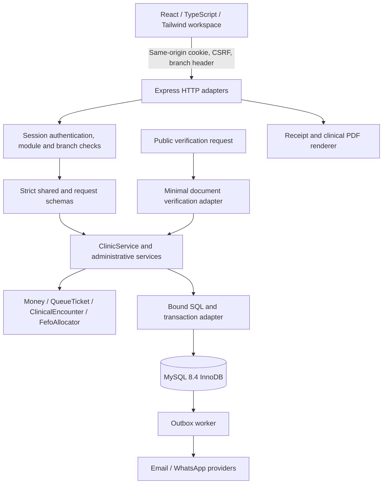

# V2 architecture

## Deployment shape

The system is a modular monolith: one React workspace, one Express API and a separate notification worker share MySQL 8.4.
MySQL/InnoDB is authoritative. Browser state never establishes identity, stock quantities or financial balances.

## Boundaries and ownership

| Layer                | Responsibility                                                                        | Source                                       |
| -------------------- | ------------------------------------------------------------------------------------- | -------------------------------------------- |
| Browser              | Accessible forms, actual API state, module navigation, loading/error feedback         | `src/client`                                 |
| Shared contracts     | Module IDs, password bounds, positive identifiers, Malaysian IC parsing               | `src/shared`                                 |
| HTTP adapters        | Session context, untrusted input validation, route authorization, error mapping, PDFs | `src/server/app.ts`, routers, `security.ts`  |
| Application services | Workflow coordination, scoped reads, transactions, audit and outbox writes            | `src/server/service.ts`, `administration.ts` |
| Domain behavior      | Money arithmetic, queue transitions, encounter rules and FEFO allocation              | `src/domain/models.ts`                       |
| Persistence          | Pooling, bound parameters, UTC serialization, commit/rollback and migration runner    | `src/server/db.ts`, `src/server/db`          |
| External delivery    | Provider adapters and asynchronous outbox processing                                  | Notifications and worker files               |

Classes encapsulate behavior where invariants matter. Simple record projections remain data rather than empty OOP wrappers.
Shared contracts and reusable forms reduce duplicated logic. Existing services are concrete; a universal repository-interface layer is not claimed.

Clinical document snapshots project through a shared letter view model for browser preview and PDF rendering.
Authenticated projections apply diagnosis redaction and expose display fields rather than signing or verification secrets.
Prescription activity reads existing encounter, reservation and stock-movement ledgers; displaying history does not allocate stock.
Patient medication-taking is a separate scoped clinical ledger with outcome, source, amount, occurrence time and recording staff.
It records reports or observations rather than inferring adherence from stock movements; entries do not alter inventory.

Prescription signing and physical dispensing share the FEFO allocator through explicit reservation-ledger operations.
Signing holds eligible batches inside its encounter transaction; dispensing excludes other holds and records physical movements once.
Inventory item locks serialize competing allocations. General supply usage has its own idempotent header and audited movement allocations, with no medication bypass.

The browser guide uses reusable control anchors and an optional walkthrough overlay.
It explains permitted workflows by highlighting live controls without submitting records.
Responsive navigation, forms and scroll-contained tables share the workspace styles; phone tour instructions fit the viewport.

## Authorization and projections

Authentication resolves an active user, tenant, authorized branch and CSRF token.
Role module permissions refresh on every request. ADMIN retains all modules; chart creation/signing still requires DOCTOR. Patient-taking reports permit DOCTOR or NURSE with clinical access.
Branch membership remains mandatory even when a module is granted.

Composite foreign keys constrain organization relationships, while scoped queries validate selected-branch ownership.
There is no claim of MySQL row-level security. Direct database access bypasses application permissions and stays restricted.

Minimal patient and medication references allow workflows without granting the entire registry or stock module.
The clinical banner and dispensary queue expose only their required fields.
Public certificate verification omits patient identity. The authenticated waiting-room projection omits names and diagnoses.

## Transactions and concurrency

One transaction owns each multi-record operation, including stock receipt/dispensing, checkout, deposit spending and document issuance.
READ COMMITTED transactions use stable resource locks and row locks for cross-row invariants.
Optimistic versions reject stale patient, booking, queue and draft-chart edits.
Booking and MC scope locks serialize overlap checks. Generated queue uniqueness protects active visits and occupied rooms.
Idempotency keys protect dispensing and financial retries. Changed checkout payloads cannot reuse a successful key.

The adapter supports numbered application parameters and limited `RETURNING` behavior through same-transaction follow-up reads.
These are adapter conventions, not native MySQL syntax. SQL changes must fit the supported subset or use explicit native reads.

## Data representation

After migration 009, all entity IDs/FKs are unsigned BIGINT; the API accepts positive JavaScript-safe integers.
Display aliases `tenantNumber`, `branchNumber` and `patientNumber` equal actual entity IDs.
Sequences are table-wide and may contain gaps. Random cryptographic tokens remain strings.

UTC timestamps serialize as ISO strings. Civil dates remain date-only strings; clinic service dates use Asia/Kuala_Lumpur.
Serialization preserves user-defined JSON keys and free text, including text resembling dates.
Patient history uses timestamp/ID cursors to retain records sharing a timestamp.
Typed JSON references require service validation; SQL foreign keys do not validate prescription arrays.

## Notifications and live updates

Transactional outbox creation separates clinic completion from external provider availability.
The worker handles delivery states and retries; unconfigured providers never report success.
Provider acceptance is recorded as SENT, without implying a delivery/read receipt.

Queue events are process-local SSE signals with client refresh fallback.
Multiple API replicas require shared fanout and shared rate-limit strategy before promising equivalent live behavior.
The current deployment is not described as horizontally scaled or high-availability infrastructure.

## Historical boundaries and evolution

Packages, commissions, payroll and clinical photos are retired through deployed route guards returning 410.
Their tables, historical adapters and migration handling remain for retention; GP checkout does not append commissions.
The schema and API retain historical specialty enum values; the current clinical UI workflow is GP.

Migrations are ordered and checksummed. Migration 009 converts actual identifiers and protected historical snapshots.
It requires an offline upgrade, verified backup and original keys when protected records exist.
Interrupted DDL conversion requires backup restoration; it is not safely retried against partial state.

See [database evolution](DATABASE.md), [ERD](ERD.md), [system flow](SYSTEM_FLOW.md), [API](API.md) and [testing](TESTING.md).

## Browser demo exception

The separate demo build substitutes a lazily loaded browser store at the client API boundary.
`VITE_DEMO_MODE === 'true'` enables it; normal builds continue to call the real API.
The store uses tab-scoped sessionStorage and no database/provider credentials. An explicit reset clears only its namespace.
Initial fictional patient, queue, appointment, prescription, stock and billing fixtures belong only to `DemoClinic`.
Reset restores these examples. Real MySQL bootstrap contains setup records only; guarded development seeding is never automatically invoked.
Demo-only account switching and workflow validation are simulations, not server security or MySQL transaction guarantees.
SSE is disabled. PDFs and receipts show an unavailable explanation instead of pretending to issue clinical documents.
The sample-data banner remains visible on login, operational screens and display pages.
Tab refresh preserves demo records; tab-session termination usually discards them, while browser session restore can retain them.

## Administrator catalog boundary

CatalogService and catalog-router.ts own branch-scoped reference choices and inventory metadata changes. Shared catalogs.ts defines kinds and DTOs. Active choices feed clinical and inventory selectors; ADMIN writes require CSRF, scoped transactions, versions and audit. Workflow statuses and role codes remain application invariants. Signed prescriptions capture authoritative medication metadata, preserving new history after display-name edits.

WorkspaceSections is a shared client component for task navigation. Each WorkspaceSection remains mounted while inactive sections use native hidden semantics, preserving in-module input state and excluding inactive controls from keyboard/assistive-technology navigation. Buttons expose current section and associated region. The component creates no secondary vertical scrolling container. GuidedTour activates hidden sections before highlighting controls. No API, authorization or database schema changed.
