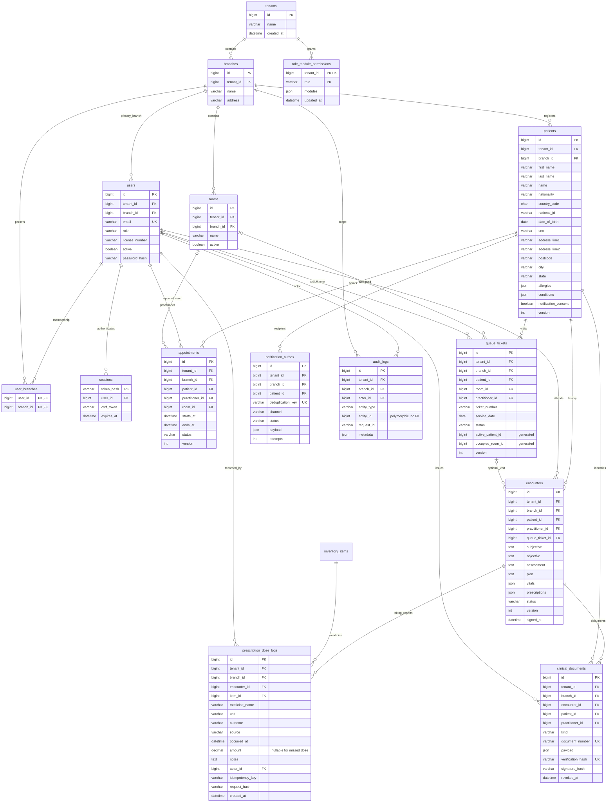
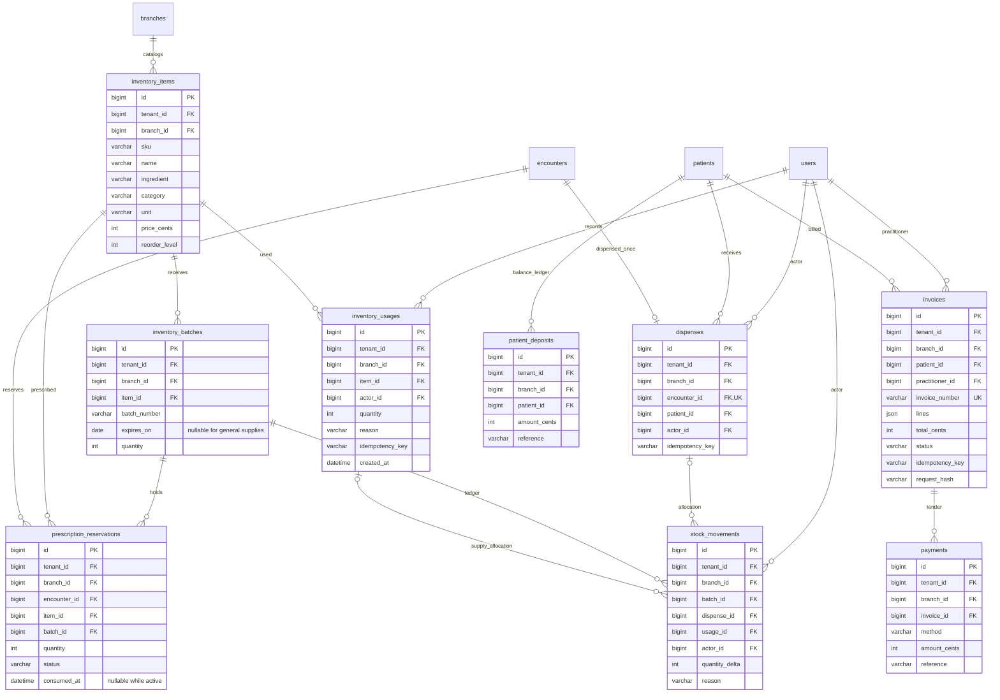
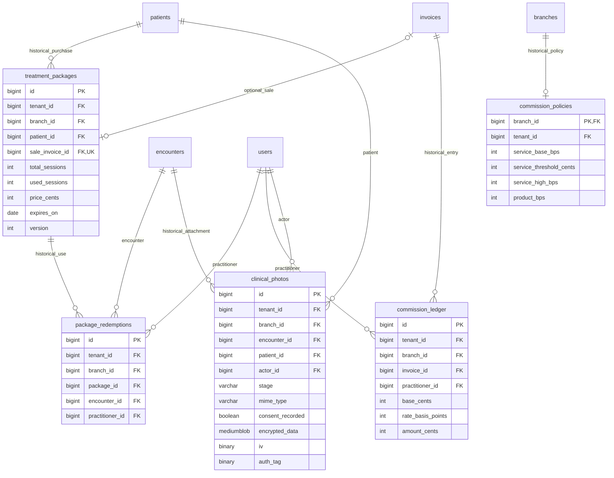
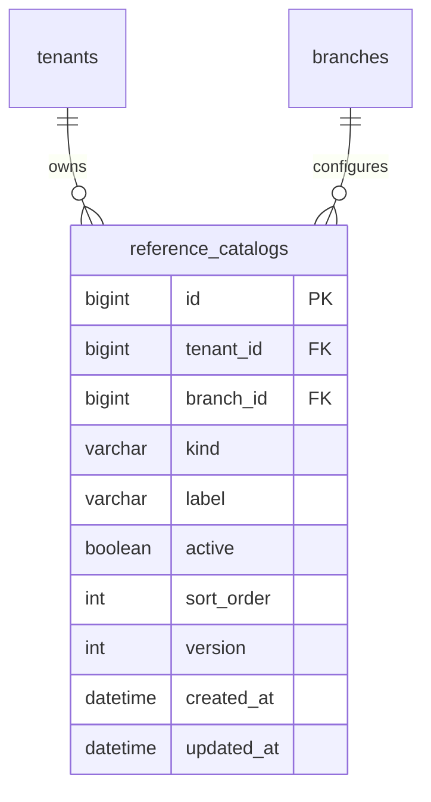

# Entity relationship diagrams

These diagrams describe the final MySQL 8.4 schema after migrations 001–016, including numeric conversion, general supplies and prescription reservations.
Every displayed entity `id` is `BIGINT UNSIGNED AUTO_INCREMENT`; referenced IDs are unsigned BIGINT.
Mermaid `bigint` labels omit unsigned/auto-increment syntax for readability. Exact SQL remains authoritative.
Letter previews reuse `clinical_documents.payload`; prescription activity joins encounters, reservations, dispenses and stock movements. Neither read projection adds an entity.

## Organization, registry and clinical operations

## Inventory and finance

Prescription `itemId` values reside inside encounter JSON, not a normalized prescription FK table.
Service validation enforces medication ownership. Payment sum, deposit balance and FEFO ordering require transactions.

## Historical features, not active workflows

## Composite keys and constraint detail

Diagrams omit repeated organization edges to remain readable. These SQL constraints carry scope across the relationships:

| Constraint family                                                                                               | Meaning                                                           |
| --------------------------------------------------------------------------------------------------------------- | ----------------------------------------------------------------- |
| branches `(tenant_id,id)` unique                                                                                | Scoped branch FK target                                           |
| patients/users `(tenant_id,id)` unique                                                                          | Tenant-bound person/account FK targets                            |
| rooms/appointments/queue/encounters/items/batches/dispenses/invoices/packages `(tenant_id,branch_id,id)` unique | Branch-bound FK targets                                           |
| user_branches `(user_id,branch_id)` PK                                                                          | Membership pair, not another entity ID                            |
| role_module_permissions `(tenant_id,role)` PK                                                                   | One override per tenant/role                                      |
| patients `(tenant_id,national_id)` unique                                                                       | Prevent duplicate tenant identity number                          |
| rooms `(branch_id,name)` unique                                                                                 | Branch room naming                                                |
| queue `(branch_id,active_patient_id)` unique                                                                    | One active patient visit per branch; nullable terminal projection |
| queue `occupied_room_id` unique                                                                                 | One called/in-consultation visit per room                         |
| queue `(branch_id,service_date,ticket_number)` unique                                                           | Ticket numbering within clinic day                                |
| inventory item `(branch_id,sku)` and batch `(item_id,batch_number)` unique                                      | Catalog and batch identity                                        |
| dispense `encounter_id` and `(branch_id,idempotency_key)` unique                                                | Single dispense and safe retries                                  |
| invoice `(branch_id,idempotency_key)` unique                                                                    | Retry-safe checkout                                               |
| historical redemption `(package_id,encounter_id)` unique                                                        | Prevent duplicate historical redemption                           |

`resource_locks(lock_key varchar(200) PRIMARY KEY)` has no entity FK and is omitted from relationship diagrams.
Sessions retain secret-keyed identities. Migration bookkeeping is likewise not an operational entity.
Checks enforce permitted status values, positive/nonnegative quantities, appointment ordering and MC dates.
Cross-row overlaps, selected-branch patient ownership and JSON-contained references remain application invariants.

See [database dictionary and upgrades](DATABASE.md) and [system flow](SYSTEM_FLOW.md).

These relationships describe the real MySQL application. Browser demo records are sessionStorage objects without database FK enforcement.
Preloaded fictional business records belong only to the browser demo; normal MySQL bootstrap does not insert them into these tables.

## Managed reference choices

Inventory items also carry active status, optimistic version and update time after migration 014.

Migration 015 adds branches.active/version/updated_at and invoices.receipt_snapshot (nullable JSON). Entity IDs, table counts and FK relationships stay unchanged. The snapshot copies issued receipt metadata; it creates no new live relationship or entity ID.
