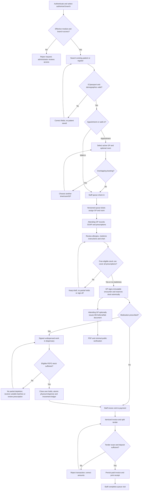
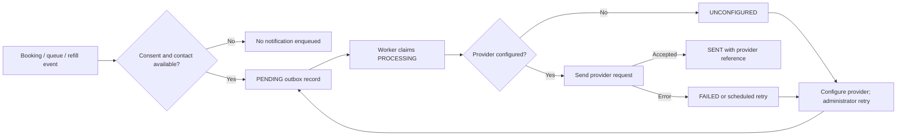

# Clinic system flow

## Main staff workflow

Queue movement, document issuance and checkout are explicit staff actions. Signing does not automatically complete a queue visit or collect payment.



Appointment check-in and completion statuses are not advertised as automatic synchronization with queue actions.
The API supports booking cancellation; the current booking screen requires separate API handling for that operation.
See [staff guide](USER_GUIDE.md) for screen-level steps.

## Guided screen walkthrough

Staff open **User guide**, choose an available workflow and start its interactive walkthrough.
The walkthrough navigates to the permitted module and circles the relevant control.
**Next** and **Back** move between explanations; **Close** or Escape ends the walkthrough.
Forms may open for explanation, but saving, signing, dispensing and payments remain explicit staff actions.
Phone instructions remain inside the viewport while the relevant control scrolls into view.

## Request and transaction sequence

```mermaid
sequenceDiagram
  actor Staff
  participant UI as Browser
  participant API as Express
  participant Service as Application service
  participant DB as MySQL
  Staff->>UI: Save workflow action
  UI->>API: Cookie, CSRF, branch, validated payload
  API->>API: Authenticate, authorize module/branch, validate input
  alt Denied or malformed
    API-->>UI: 400/401/403; no operation
  else Authorized
    API->>Service: Server context and input
    Service->>DB: Begin; acquire resource/row locks
    Service->>DB: Check version, invariants and retry key
    alt Stale/conflict/insufficient stock or balance
      Service->>DB: Rollback
      Service-->>API: Domain conflict
      API-->>UI: Error; refresh or correct fields
    else Valid operation
      Service->>DB: Write records, audit and applicable outbox
      Service->>DB: Commit
      Service-->>API: Persisted result
      API-->>UI: Success and optional queue refresh signal
      UI->>API: Refresh affected lists
    end
  end
```

Use current versions after conflicts; never overwrite silently. Retry uncertain financial responses with the same key and unchanged payload.
Failed checkout does not imply an invoice exists. Repeated dispense cannot allocate stock twice.

Signing reduces available stock by reservations, while batch quantity remains physical stock until dispensing.
An expired hold can be replaced with eligible fresh stock during the dispense transaction; failure restores prior holds.
Non-medication supply usage follows its own idempotent allocation and movement ledger, without requiring a prescription or permitting medication bypass.

## Notification delivery



Clinic writes commit independently of provider availability. SENT records provider acceptance, not guaranteed delivery or reading.
Booking messages include calendar/maps context. Queue-near and refill reminders depend on actual eligible server records.

## Document integrity and revocation

Issuance locks MC overlap scope where relevant, snapshots signed clinical data and stores a signing HMAC plus verification hash.
Authenticated PDF reads and public verification check integrity. Public responses exclude patient names and diagnosis.
The issuing GP revokes with a reason; replacement creates a new document rather than modifying the old snapshot.
Issued and historical document actions open a readable letter preview. Downloading its PDF is a separate explicit action.
Certificate redaction and revocation status remain visible in the preview and rendered output.

Prescription history reads the encounter, reservation and dispense/movement ledgers without changing stock.
It shows clinic actions and prescribed frequency; patient dose-taking is not inferred from stock movements.
Clinical staff separately record taken or missed doses against signed prescriptions, with patient-report or staff-observation source.
Medication-taking entries stay in the clinical workspace and do not consume physical stock or prescription holds.

## Administrative lifecycle

Create branch, rooms and staff before scheduling. Active branch-assigned DOCTOR accounts become GP choices automatically.
Role grants enable workflows while clinical authority remains separately restricted.
Room rename/archive checks occupancy and future bookings; historical links remain intact.
Staff deactivation invalidates usable authentication; password changes invalidate sessions.

Architecture, schema and tested failure cases are documented in [architecture](ARCHITECTURE.md), [ERD](ERD.md) and [test cases](TEST_CASES.md).

## Browser demo exception

The demo follows the same screen sequence using sample records in sessionStorage.
It does not execute server authentication, MySQL transactions, provider sends or cryptographic clinical issuance.
Reset demo clears that browser namespace and returns to login; local MySQL records are unaffected.
Reset restores the original fictional workflow examples. They are never loaded by normal MySQL bootstrap.

Administrators configure branch choices → active choices appear in clinical/stock forms → server validates and captures medication metadata → signed prescriptions preserve snapshots → archival hides future choices while preserving historical dispensing and stock operations.
