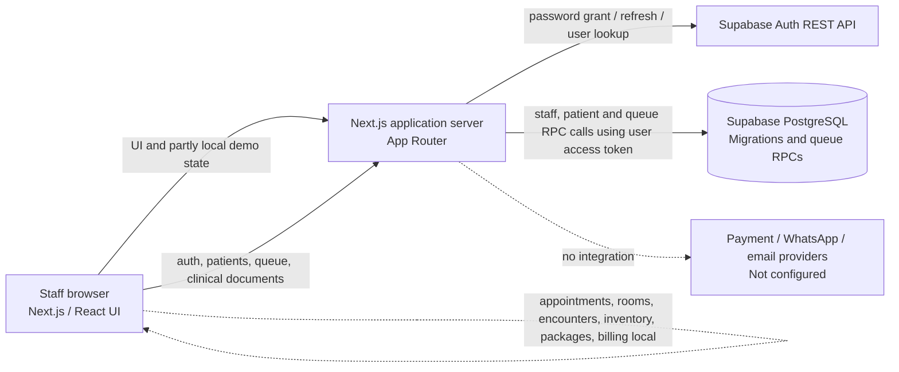

# System architecture

## Current topology



Solid paths include implemented authentication, patient, queue, clinical-document and public document-verification routes. The dashed lines identify missing application integrations. The schema exists as migrations; this documentation cannot confirm they have been applied to any hosted project.

## Current implementation status

The working data boundary is partial: authentication, patient, queue, and clinical document operations are backed by PostgreSQL; appointments, rooms, encounter/prescriptions, billing, inventory, packages and notifications remain demonstrations or unavailable. Operational API access requires explicit `role_permissions` rows because the migrations are safe-default-deny.

## Components and responsibility

| Component | Responsibilities today | Principal files |
| --- | --- | --- |
| Next.js client | UI navigation, patient/queue/document load and write requests, sample rooms/encounters/packages/inventory, demo payment flows | [`app/page.tsx`](../app/page.tsx), [`lib/data/clinic-store.ts`](../lib/data/clinic-store.ts) |
| Session provider | Fetch current session, call login/logout endpoints, adapt the staff profile for UI | [`lib/state/session.tsx`](../lib/state/session.tsx) |
| Auth route handlers | Sign in, resolve/refresh, revoke Supabase Auth sessions; set HttpOnly cookies | [`app/api/auth`](../app/api/auth), [`lib/server/supabase-auth.ts`](../lib/server/supabase-auth.ts) |
| Patient/queue route handlers | Read/create patients; read/create/update queue tickets with active session and RLS JWT | [`app/api/patients`](../app/api/patients), [`app/api/queue`](../app/api/queue) |
| Document route handlers | Issue, list, regenerate, revoke, and log prints for clinical documents; expose status-only QR verification | [`app/api/clinical-documents`](../app/api/clinical-documents), [`app/api/document-verification`](../app/api/document-verification) |
| Supabase Auth | External identity credential verification/session issuance | Configured only when project URL and anon key are supplied |
| PostgreSQL migrations | Define clinic tables, constraints, safe-default-deny RLS, append-only triggers, document verification and atomic queue RPCs | [`supabase/migrations`](../supabase/migrations) |
| Print view | Renders print-friendly document artifact and invokes browser print dialog | [`components/documents`](../components/documents) |

### Implemented persistence/API surface

| Route | Database operation |
| --- | --- |
| `GET /api/patients` | Read branch-visible patient directory |
| `POST /api/patients` | Validate/register patient, encrypt identifier, store HMAC duplicate key |
| `GET /api/patients/{id}` | Read/decrypt one patient's national identifier |
| `GET, POST /api/clinical-documents` | Read current document versions and issue an MC, referral, or lab requisition |
| `POST /api/clinical-documents/{id}/versions` | Create immutable revision from current persisted source data |
| `POST /api/clinical-documents/{id}/print` | Append print-attempt record before opening browser print |
| `POST /api/clinical-documents/{id}/revoke` | Revoke document and invalidate verification status |
| `GET /api/document-verification?token=…` | Return only `valid` or `revoked` for the opaque token |
| `GET /api/queue` | Read branch-visible tickets |
| `POST /api/queue` | Call `create_queue_ticket`; atomically create a ticket and its initial event |
| `PATCH /api/queue` | Call `transition_queue_ticket`; atomically change a ticket and append its event |

`NEXT_PUBLIC_CLINIC_DEMO_MODE` is opt-in and defaults off. When set to `true`, the client initializes sample arrays and skips patient/queue/document database hydration. Those demo workflows are local; success messages identify demo-only records. In non-demo mode, failed patient/queue/document hydration shows an error instead of silently displaying seeded records.

In non-demo mode, queue creation and supported ticket status transitions persist. The client optimistically updates its in-memory view after a successful response; there is no realtime subscription, so other sessions need a refresh/reload to observe changes. Existing-patient check-in also calls the queue create endpoint. The room list is still sample/local and is not hydrated from PostgreSQL.

The non-demo dashboard banner identifies current PostgreSQL-backed areas (patient registration/directory, queue tickets/status history, and clinical documents) and lists remaining non-persisted domains. The queue screen distinguishes database mode from local demo mode and explains that live updates and room configuration are not yet available. Document issue/revision/print/revocation uses database RPCs; QR verification returns status only.

### Still demo-only or not implemented

Appointment booking, room records, encounter/consultation, medication orders, package redemptions, inventory movements, invoices, payments, notifications, commissions, and broad audit workflows have no application data routes. Receipts are not issued in live mode without confirmed persisted payments. These UI records are sample/local state. The application therefore mixes PostgreSQL-backed patient/queue/document records with browser demonstration data.

## Intended production topology

```mermaid
flowchart TB
  Staff[Reception / clinician / manager browsers]
  Next[Next.js web app and authenticated API]
  Auth[Supabase Auth]
  DB[(PostgreSQL primary\nRLS + transactions)]
  Worker[Trusted background workers]
  Payment[Acquirer / DuitNow provider]
  WA[WhatsApp Business provider]
  Mail[Email delivery provider]
  Verify[Public document verification endpoint]
  Storage[Private object storage\n(if attachments are introduced)]
  Staff --> Next
  Next --> Auth
  Next -->|user JWT / RLS| DB
  Next -->|transactional outbox| DB
  Worker --> DB
  Worker --> Payment
  Worker --> WA
  Worker --> Mail
  Staff --> Verify
  Verify -->|minimal status only| DB
  Next -. future, protected .-> Storage
```

This target is architectural direction, not delivered provider infrastructure. Do not route real PHI through the current frontend preview flows.

## Authentication and authorization path

1. `POST /api/auth/login` accepts email and password, requests a Supabase password-grant session, looks up an active `staff_members` profile, and sets `kumo_access_token` and `kumo_refresh_token` as HttpOnly cookies. The access cookie is capped at 15 minutes; refresh cookie is 7 days. Secure flag is enabled in production; cookies use SameSite=Lax.
2. `GET /api/auth/session` resolves/refreshes a session and returns the staff profile. `POST /api/auth/logout` attempts upstream revocation and clears local cookies even on upstream failure.
3. Domain table RLS uses `auth.uid()` matched to an active clinic+branch staff membership and explicit `role_permissions` entries. Patient, queue, and clinical-document routes forward the signed-in user's JWT to PostgREST, so database RLS applies. Migrations seed no permission entries, so these routes remain denied until permissions are provisioned for the active branch/role. The NRIC reveal endpoint alone uses the service role to append an audit row after checking the user's distinct identifier permission; it fails closed if audit cannot be written. Other ordinary API operations must use the user JWT.

The auth helper returns `staff_members.id` separately from `auth_user_id`. If an account has more than one active branch profile, login returns `409 BRANCH_SELECTION_REQUIRED`; branch selection is not implemented. The browser session adapter does not expose `clinic_id`. The UI's role permission matrix is client-side and is not a replacement for database/API authorization. The current patient/queue routes add explicit role checks to create operations, but future data writes still need comprehensive role/permission and transaction design.

## Data boundaries and transaction design

- Each transaction for operational mutations should derive the active membership server-side and establish a clinic/branch context from that membership. Current patient and queue create routes derive clinic/branch from the authenticated profile and pass the end-user JWT to PostgREST.
- Composite foreign keys that include clinic/branch IDs enforce same-tenant references for patient, appointment, encounter, invoice, inventory and document relations.
- The `create_queue_ticket` and `transition_queue_ticket` database functions commit ticket creation/status change and the corresponding immutable queue event atomically. Queue status changes use an expected-status check to reject stale competing updates.
- Payment webhook handling must validate provider signatures, verify provider event identity, and use idempotency keys before recording successful payment. Current demo buttons do not perform payment operations.
- Inventory dispense should lock eligible non-expired batches in FEFO order, write movement records, and update quantity atomically. A FEFO index exists; no dispense service exists.
- Document issue/revision, content hash, version-bound verification-token digest, and print record are persisted through permission-checked RPCs. Public verification returns status only. A shared rate limiter is not configured.

## Deployment units and environments

The repository currently defines a Next.js application and a Supabase migration. A production deployment will need separately managed web runtime, PostgreSQL/Supabase project, Auth configuration, trusted worker runtime for provider/outbox processing, secrets management, TLS/domain, database backup controls, and monitoring/alerting. No deployment manifest, CI pipeline, provider worker, storage integration, or environment file with real credentials is present.
