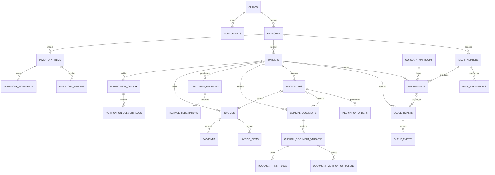

# PostgreSQL database design

## Authority and status

The authoritative current schema is defined by [`20261005010000_clinic_foundation.sql`](../supabase/migrations/20261005010000_clinic_foundation.sql), [`20261005020000_queue_transitions.sql`](../supabase/migrations/20261005020000_queue_transitions.sql), and [`20261005030000_clinical_document_lifecycle.sql`](../supabase/migrations/20261005030000_clinical_document_lifecycle.sql). Together they are PostgreSQL migrations using `pgcrypto`, `btree_gist`, UUID identifiers, `jsonb`, PostgreSQL enums, exclusion constraints, security-definer functions, and row-level security (RLS). Supabase supplies Auth and the `auth.uid()` identity function.

This is a **foundation migration**, not an application-ready data layer: operational UI does not yet read/write these relations. A production database must be provisioned, migration applied, and RLS reviewed before use. The older SQL sketch in the product specification is aspirational and has different details; where they differ, this document describes the actual migration.

## Relational overview

All operational records are clinic/branch-scoped. Composite foreign keys pair entity IDs with `clinic_id` and `branch_id`, preventing accidental cross-branch links at the database level. The ER diagram omits many actor, room, practitioner, and optional history relationships for readability; the data dictionary and migration contain the exact constraints.

## Common conventions

- Most identifiers are `uuid primary key default gen_random_uuid()`; `audit_events.id` is a bigint identity.
- Timestamps are `timestamptz`; business dates use `date`; money uses fixed-scale `numeric` and a `MYR` default.
- Nearly all operational tables carry mandatory `clinic_id` and `branch_id`.
- A redundant unique key `(id,clinic_id,branch_id)` is deliberately present on referenced rows so composite foreign keys can enforce same-tenant references.
- Delete actions are generally `RESTRICT`; history is preserved. Selected actor links use `SET NULL`, branches' permission rows cascade on delete.
- `created_at` / `updated_at` columns have defaults, but the migration does **not** install a general `updated_at` maintenance trigger. Application updates must set `updated_at` or add a reviewed trigger.

## Enumerated types

| Type | Values |
| --- | --- |
| `staff_role` | `doctor`, `receptionist`, `nurse`, `manager` |
| `appointment_status` | `booked`, `confirmed`, `arrived`, `cancelled`, `no_show`, `completed` |
| `queue_status` | `registered`, `triage_waiting`, `called_to_room`, `in_consultation`, `dispensary_waiting`, `payment_waiting`, `completed`, `no_show` |
| `encounter_status` | `open`, `signed`, `amended`, `voided` |
| `clinical_document_type` | `medical_certificate`, `referral_letter`, `lab_requisition` |
| `clinical_document_status` | `active`, `revoked` |
| `inventory_movement_type` | `receipt`, `dispense`, `adjustment`, `transfer_in`, `transfer_out`, `waste`, `return` |
| `invoice_status` | `draft`, `issued`, `partially_paid`, `paid`, `voided`, `refunded` |
| `payment_status` | `pending`, `succeeded`, `failed`, `voided`, `refunded` |
| `notification_channel` | `whatsapp`, `email` |
| `notification_status` | `queued`, `sending`, `sent`, `delivered`, `failed`, `cancelled` |

## SQL function and trigger inventory

| Function | Migration | Responsibility/access |
| --- | --- | --- |
| `has_branch_access(uuid,uuid)`, `has_clinic_access(uuid)`, `is_branch_manager(uuid,uuid)`, `current_staff_member_id(uuid,uuid)` | Foundation | Security-definer membership helpers; execution revoked from `PUBLIC`/`anon`, granted to `authenticated`. |
| `has_branch_permission(uuid,uuid,text)` | Foundation | Security-definer check for active staff role plus explicit allowed branch permission; granted to `authenticated`; missing permission is false. |
| `reject_mutation()` | Foundation | Trigger function that rejects UPDATE/DELETE on designated append-only history relations. |
| `verify_clinical_document(text)` | Foundation | Public execute for anon/authenticated; hashes supplied token and returns only `valid` or `revoked`. |
| `bind_audit_actor()` | Foundation | Trigger function; when an auth identity is present, assigns `actor_id` from active branch membership and rejects missing membership. A trusted service-role path without `auth.uid()` must validate actor itself. |
| `create_queue_ticket(uuid,text)` | Queue follow-on | Creates ticket and initial event atomically; see [queue RPC details](#queue-rpc-functions). |
| `transition_queue_ticket(uuid,queue_status,queue_status,uuid,text)` | Queue follow-on | Validates/updates ticket and appends event atomically; see [queue RPC details](#queue-rpc-functions). |
| `issue_clinical_document(uuid,uuid,clinical_document_type,text,jsonb,bytea)` | Clinical-document lifecycle | Checks clinician/manager identity and `documents.write`, then inserts a document, immutable version, and version-specific verification-token digest atomically. |
| `regenerate_clinical_document(uuid,integer,jsonb,bytea)` | Clinical-document lifecycle | Locks the active document, compares expected version, and appends an immutable version and token digest atomically. |
| `record_clinical_document_print(uuid,integer,text)` | Clinical-document lifecycle | Requires `documents.read` and appends a print-attempt row for the selected version. |
| `revoke_clinical_document(uuid,text)` | Clinical-document lifecycle | Requires `documents.delete`, records reason/actor/time, and invalidates the document's public verification status. |

## Data dictionary

Types below are PostgreSQL types. `PK` means primary key, `FK` foreign key, `UQ` unique, `NN` not null. Defaults/checks and important references follow each table. Composite FKs are expressed as `(target_id, clinic_id, branch_id)` unless noted.

### Tenant, branch, and access control

| Table | Columns and constraints |
| --- | --- |
| `clinics` | `id uuid PK`; `name text NN`; `country_code char(2) NN default 'MY' CHECK='MY'`; `timezone text NN default 'Asia/Kuala_Lumpur'`; `currency char(3) NN default 'MYR' CHECK='MYR'`; `settings jsonb NN default {}` CHECK object; `created_at`, `updated_at timestamptz NN default now()`. |
| `branches` | `id uuid PK`; `clinic_id uuid NN FK→clinics RESTRICT`; `name`, `code text NN`; `address jsonb NN default {}` CHECK object; `phone text`; `is_active boolean NN default true`; timestamps NN; UQ `(clinic_id,code)`, `(id,clinic_id)`. |
| `staff_members` | `id uuid PK`; `auth_user_id uuid NN FK→auth.users RESTRICT`; `clinic_id`, `branch_id uuid NN`; `full_name text NN`; `role staff_role NN`; `active boolean NN default true`; `license_number text`; timestamps NN; UQ `(auth_user_id,clinic_id,branch_id)`, `(id,clinic_id,branch_id)`; composite FK branch+clinic→branches RESTRICT. |
| `role_permissions` | `id uuid PK`; `clinic_id`, `branch_id uuid NN`; `role staff_role NN`; `permission_key text NN CHECK /^[a-z][a-z0-9_.:-]{1,99}$/`; `is_allowed boolean NN default false`; `updated_by uuid FK→staff_members SET NULL`; `updated_at timestamptz NN default now()`; UQ `(clinic_id,branch_id,role,permission_key)`; branch FK CASCADE. |

### Patients, scheduling, queue, and clinical care

| Table | Columns and constraints |
| --- | --- |
| `patients` | `id uuid PK`; `clinic_id`, `branch_id uuid NN`; `medical_record_number text NN`; `national_id_ciphertext text`; `national_id_hash bytea`; `full_name text NN`; `date_of_birth date`; `gender text CHECK female/male/other/unknown`; `phone`, `email text`; `blood_group text CHECK A+/A-/B+/B-/AB+/AB-/O+/O-/unknown`; `allergies jsonb NN default [] CHECK array`; `chronic_conditions jsonb NN default [] CHECK array`; `pdpa_consent_at timestamptz`; `pdpa_consent_version text`; `created_by uuid FK→staff_members SET NULL`; `created_at`, `updated_at timestamptz NN default now()`; `archived_at timestamptz`; UQ `(clinic_id,branch_id,medical_record_number)`, `(id,clinic_id,branch_id)`; branch FK RESTRICT. Active (unarchived) national ID hashes unique per clinic. |
| `consultation_rooms` | `id uuid PK`; `clinic_id`, `branch_id uuid NN`; `room_number text NN`; `attending_practitioner_id uuid`; `is_active boolean NN default true`; `created_at timestamptz NN default now()`; UQ `(clinic_id,branch_id,room_number)`, `(id,clinic_id,branch_id)`; branch FK and composite practitioner FK RESTRICT. |
| `appointments` | `id uuid PK`; `clinic_id`, `branch_id`, `patient_id`, `practitioner_id uuid NN`; `room_id uuid`; `starts_at`, `ends_at timestamptz NN`; `status appointment_status NN default booked`; `reason`, `notes text`; `created_by uuid FK→staff_members SET NULL`; timestamps NN; `cancelled_at timestamptz`; CHECK `ends_at>starts_at`; UQ `(id,clinic_id,branch_id)`; composite patient/practitioner/room FKs RESTRICT. GiST exclusion constraints reject overlapping non-cancelled/non-no-show practitioner appointments and, when room is assigned, room appointments. |
| `queue_tickets` | `id uuid PK`; `clinic_id`, `branch_id`, `patient_id uuid NN`; `appointment_id uuid`; `ticket_number text NN`; `status queue_status NN default registered`; `priority smallint NN default 0 CHECK 0..9`; `room_id`, `practitioner_id uuid`; `registered_at timestamptz NN default now()`; `called_at`, `completed_at timestamptz`; `created_by uuid FK→staff_members SET NULL`; timestamps NN; UQ `(clinic_id,branch_id,ticket_number)`, `(id,clinic_id,branch_id)`; composite patient/appointment/room/practitioner FKs RESTRICT. |
| `queue_events` | `id uuid PK`; `clinic_id`, `branch_id`, `queue_ticket_id uuid NN`; `from_status queue_status`; `to_status queue_status NN`; `room_id`, `practitioner_id uuid`; `note text`; `actor_id uuid FK→staff_members SET NULL`; `occurred_at timestamptz NN default now()`; composite ticket/room/practitioner FKs RESTRICT. Append-only. |
| `encounters` | `id uuid PK`; `clinic_id`, `branch_id`, `patient_id uuid NN`; `queue_ticket_id`, `appointment_id uuid`; `practitioner_id uuid NN`; `status encounter_status NN default open`; `chief_complaint`, `subjective`, `assessment`, `plan text`; `objective jsonb NN default {}` CHECK object; `diagnosis_codes jsonb NN default []` CHECK array; `signed_at timestamptz`; timestamps NN; UQ `(id,clinic_id,branch_id)`; composite patient/ticket/appointment/practitioner FKs RESTRICT. |
| `medication_orders` | `id uuid PK`; `clinic_id`, `branch_id`, `encounter_id`, `patient_id`, `prescribed_by uuid NN`; `medication_name text NN`; `dose`, `route`, `frequency text`; `quantity numeric(12,3) NN CHECK >0`; `days_supply integer CHECK null or >0`; `instructions text`; `created_at timestamptz NN default now()`; composite encounter/patient/prescriber FKs RESTRICT. |

### Documents and print evidence

| Table | Columns and constraints |
| --- | --- |
| `clinical_documents` | `id uuid PK`; `clinic_id`, `branch_id`, `patient_id uuid NN`; `encounter_id uuid`; `document_type clinical_document_type NN`; `document_number text NN`; `status clinical_document_status NN default active`; `current_version integer NN default 1 CHECK >0`; `issued_by uuid NN`; `issued_at timestamptz NN default now()`; `revoked_at timestamptz`; `revoked_by uuid`; `revocation_reason text`; UQ `(clinic_id,branch_id,document_number)`, `(id,clinic_id,branch_id)`; CHECK active iff no `revoked_at`, revoked iff `revoked_at` set; composite patient/encounter/issuer/revoker FKs RESTRICT. |
| `clinical_document_versions` | `id uuid PK`; `clinic_id`, `branch_id`, `document_id uuid NN`; `version_number integer NN CHECK >0`; `content jsonb NN CHECK object`; `content_sha256 bytea NN CHECK 32 bytes`; `change_reason text`; `created_by uuid NN`; `created_at timestamptz NN default now()`; UQ `(document_id,version_number)`, `(id,clinic_id,branch_id)`; composite document/creator FKs RESTRICT. Append-only. |
| `document_verification_tokens` | `id uuid PK`; `clinic_id`, `branch_id`, `document_version_id uuid NN`; `token_sha256 bytea NN UQ CHECK 32 bytes`; `expires_at`, `revoked_at timestamptz`; `created_at timestamptz NN default now()`; composite version FK RESTRICT. Direct table access revoked from `anon` and `authenticated`. |
| `document_print_logs` | `id uuid PK`; `clinic_id`, `branch_id`, `document_version_id`, `printed_by uuid NN`; `purpose text`; `printed_at timestamptz NN default now()`; composite version/staff FKs RESTRICT. Append-only. |

### Inventory and prepaid packages

| Table | Columns and constraints |
| --- | --- |
| `inventory_items` | `id uuid PK`; `clinic_id`, `branch_id uuid NN`; `sku`, `name text NN`; `category text NN CHECK medication/aesthetic_consumable/retail/other`; `unit text NN default 'unit'`; `minimum_par_level numeric(12,3) NN default 0 CHECK >=0`; `is_active boolean NN default true`; timestamps NN; UQ `(clinic_id,branch_id,sku)`, `(id,clinic_id,branch_id)`; branch FK RESTRICT. |
| `inventory_batches` | `id uuid PK`; `clinic_id`, `branch_id`, `inventory_item_id uuid NN`; `batch_number text NN`; `expires_on date`; `quantity_on_hand numeric(12,3) NN default 0 CHECK >=0`; `received_at timestamptz NN default now()`; `created_at timestamptz NN default now()`; UQ `(inventory_item_id,batch_number)`, `(id,clinic_id,branch_id)`; composite item FK RESTRICT. |
| `inventory_movements` | `id uuid PK`; `clinic_id`, `branch_id`, `inventory_item_id uuid NN`; `batch_id uuid`; `movement_type inventory_movement_type NN`; `quantity_delta numeric(12,3) NN CHECK <>0`; `reference_type text`; `reference_id uuid`; `reason text`; `actor_id uuid FK→staff_members SET NULL`; `occurred_at timestamptz NN default now()`; composite item/batch FKs RESTRICT. Append-only. |
| `treatment_packages` | `id uuid PK`; `clinic_id`, `branch_id`, `patient_id uuid NN`; `package_name text NN`; `total_sessions integer NN CHECK >0`; `purchase_date date NN default current_date`; `expiry_date date`; `amount_paid numeric(12,2) NN CHECK >=0`; `currency char(3) NN default MYR CHECK MYR`; `created_by uuid FK→staff_members SET NULL`; `created_at timestamptz NN default now()`; UQ `(id,clinic_id,branch_id)`; composite patient FK RESTRICT. |
| `package_redemptions` | `id uuid PK`; `clinic_id`, `branch_id`, `package_id uuid NN`; `encounter_id uuid`; `practitioner_id uuid NN`; `session_number integer NN CHECK >0`; `notes text`; `redeemed_at timestamptz NN default now()`; composite package/encounter/practitioner FKs RESTRICT; UQ `(package_id,session_number)`. Append-only. |

### Billing, notifications, and audit

| Table | Columns and constraints |
| --- | --- |
| `invoices` | `id uuid PK`; `clinic_id`, `branch_id`, `patient_id uuid NN`; `encounter_id uuid`; `invoice_number text NN`; `status invoice_status NN default draft`; `subtotal`, `tax_amount`, `discount_amount`, `total_amount numeric(12,2) NN default 0 CHECK >=0`; `currency char(3) NN default MYR CHECK MYR`; `issued_at`, `due_at timestamptz`; `created_by uuid FK→staff_members SET NULL`; timestamps NN; UQ `(clinic_id,branch_id,invoice_number)`, `(id,clinic_id,branch_id)`; composite patient/encounter FKs RESTRICT. |
| `invoice_items` | `id uuid PK`; `clinic_id`, `branch_id`, `invoice_id uuid NN`; `description text NN`; `item_type text NN CHECK consultation/medication/procedure/package/retail/other`; `quantity numeric(12,3) NN CHECK >0`; `unit_price numeric(12,2) NN CHECK >=0`; `tax_rate numeric(7,5) NN default 0 CHECK 0..1`; `line_total numeric(12,2) NN CHECK >=0`; `practitioner_id uuid`; `created_at timestamptz NN default now()`; composite invoice/practitioner FKs RESTRICT. |
| `payments` | `id uuid PK`; `clinic_id`, `branch_id`, `invoice_id uuid NN`; `amount numeric(12,2) NN CHECK >0`; `currency char(3) NN default MYR CHECK MYR`; `method text NN CHECK cash/card/duitnow_qr/bank_transfer/insurance/deposit/package_credit/other`; `status payment_status NN default pending`; `provider`, `provider_reference`, `idempotency_key text`; `received_by uuid FK→staff_members SET NULL`; `paid_at timestamptz`; `created_at timestamptz NN default now()`; composite invoice FK RESTRICT; UQ `(clinic_id,idempotency_key)` (PostgreSQL permits multiple null keys). |
| `notification_outbox` | `id uuid PK`; `clinic_id`, `branch_id uuid NN`; `patient_id uuid`; `channel notification_channel NN`; `template_key text NN`; `recipient_ciphertext`, `payload_ciphertext text NN`; `status notification_status NN default queued`; `scheduled_at timestamptz NN default now()`; `attempt_count integer NN default 0 CHECK >=0`; `last_error_code text`; timestamps NN; UQ `(id,clinic_id,branch_id)`; composite branch/patient FKs RESTRICT. |
| `notification_delivery_logs` | `id uuid PK`; `clinic_id`, `branch_id`, `notification_id uuid NN`; `provider_message_id text`; `status notification_status NN`; `provider_status`, `error_code text`; `occurred_at timestamptz NN default now()`; composite outbox FK RESTRICT. Append-only. |
| `audit_events` | `id bigint generated always as identity PK`; `clinic_id uuid NN FK→clinics RESTRICT`; `branch_id uuid`; `actor_id uuid FK→staff_members SET NULL`; `action text NN CHECK /^[a-z][a-z0-9_.:-]{1,99}$/`; `entity_type text NN`; `entity_id uuid`; `request_id text`; `metadata jsonb NN default {}` CHECK object; `occurred_at timestamptz NN default now()`; composite branch/clinic FK RESTRICT. Append-only. A trigger binds actor to active staff membership on authenticated inserts. |

## Relationships, indexes, and invariants

The migration adds the following workload indexes (primary/unique indexes are omitted from this list):

| Index | Purpose |
| --- | --- |
| `staff_members_auth_lookup` partial on active `(auth_user_id,clinic_id,branch_id)` | Resolve active membership |
| `patients_national_id_hash_unique` partial clinic/hash for non-null hash and unarchived patients | Duplicate identity match without indexing ciphertext |
| `patients_name_search`, `patients_phone_search` partial | Branch-scoped patient search |
| `appointments_calendar`, `appointments_patient_history` | Schedule view and history |
| `queue_active_order`, `queue_patient_history`, `queue_events_history` | Active queue ordering and audit history |
| `encounter_patient_history`, `medication_orders_patient` | Clinical history retrieval |
| `clinical_document_versions_history`, `document_print_logs_history` | Document revision and print audit retrieval |
| `inventory_batches_fefo` partial where positive stock | Candidate FEFO batch ordering; does not itself implement or guarantee stock depletion |
| `inventory_movements_history` | Item ledger history |
| `treatment_packages_patient`, `package_redemptions_history` | Package balance/history reads |
| `invoices_patient_history`, `invoice_items_invoice`, `payments_invoice` | Billing history and line/payment lookup |
| `notification_outbox_due` partial queued/failed, `notification_delivery_history` | Worker polling and delivery audit |
| `audit_events_branch_timeline`, `audit_events_entity` | Audit timeline/entity lookup |

Key invariants enforced in SQL:

- Appointment end must be after start; active appointment ranges cannot overlap for the same practitioner or assigned room within a branch/clinic.
- Patient MRN is unique per branch; active national-ID hash is unique per clinic.
- Queue priority is 0–9 and each branch ticket number is unique.
- JSON columns have expected object/array shapes; money, quantity, package session counts, and status fields have checks.
- Document version content must be an object with a 32-byte SHA-256 field; version number is unique per document.
- Selected history tables reject updates/deletes using a common `reject_mutation()` trigger.

Not enforced by these migrations: one active encounter per ticket; document overlap prevention for medical leave; invoice total arithmetic/reconciliation; invoice status/payment consistency; package session count versus redemptions; batch quantity balance versus movement ledger; automatic FEFO deduction; provider webhook signature/idempotency beyond a nullable unique payment key; notification retries; prescription allergy checks; commission calculations; general `updated_at` triggers.

Queue status changes **are** constrained by the `transition_queue_ticket` function in the second migration (see [queue RPC functions](#queue-rpc-functions)). The database function enforces a transition graph and writes the matching immutable `queue_events` record in the same transaction.

## RLS and grants

RLS is enabled on all 26 application tables. Helpers are security-definer SQL functions with constrained search paths:

- `has_branch_access(clinic_id,branch_id)` requires an active `staff_members` row whose `auth_user_id = auth.uid()`.
- `has_clinic_access(clinic_id)` checks any active membership at the clinic.
- `is_branch_manager(clinic_id,branch_id)` requires active `manager` staff membership.
- `current_staff_member_id(...)` returns the current membership's internal staff row ID.

`clinics` is read only for clinic members. Branch/staff/role permission tables have membership read policies and manager `FOR ALL` policies; both `clinic_id` and `branch_id` are checked for branch-scoped permissions and manager actions. A new `has_branch_permission(clinic_id,branch_id,permission_key)` security-definer helper joins the active staff role to a matching, explicitly allowed `role_permissions` row. Operational tables have separate SELECT, INSERT, UPDATE, DELETE policies with operation-specific keys; missing permission rows and `is_allowed=false` deny access regardless of job role or branch membership. The migration inserts **no permission defaults**, so ordinary staff will initially have no operational table access until an authorized manager/trusted provisioning step inserts explicit permission rows. `role_permissions` writes themselves are manager-gated.

The permission keys in this migration are:

| Table(s) | SELECT | INSERT / UPDATE | DELETE |
| --- | --- | --- | --- |
| `patients` | `patients.read` | `patients.write` | `patients.delete` |
| `consultation_rooms` | `rooms.read` | `rooms.manage` | `rooms.manage` |
| `appointments` | `appointments.read` | `appointments.manage` | `appointments.manage` |
| `queue_tickets` direct table access | `queue.read` | No authenticated writes; use RPCs | No authenticated writes |
| `encounters` | `encounters.read` | `encounters.write` | `encounters.delete` |
| `medication_orders` | `prescriptions.read` | `prescriptions.write` | `prescriptions.delete` |
| `clinical_documents` | `documents.read` | `documents.write` | `documents.delete` |
| `inventory_items`, `inventory_batches` | `inventory.read` | `inventory.manage` | `inventory.manage` |
| `treatment_packages` | `packages.read` | `packages.manage` | `packages.manage` |
| `invoices`, `invoice_items`, `payments` | `billing.read` | `billing.write` | `billing.delete` |
| `notification_outbox` | `notifications.read` | `notifications.manage` | `notifications.manage` |
| `queue_events` history | `queue.read` | Trusted server only | No authenticated write |
| Document versions and print logs | `documents.read` | Trusted server only | No authenticated write |
| Inventory movements | `inventory.read` | Trusted server only | No authenticated write |
| Package redemptions | `packages.read` | Trusted server only | No authenticated write |
| Notification delivery logs | `notifications.read` | Trusted server only | No authenticated write |
| `audit_events` | `audit.read` | Trusted server only | No authenticated write |

Both queue RPCs require `queue.manage`; queue reads require `queue.read`. Direct authenticated INSERT/UPDATE/DELETE on `queue_tickets` is revoked so ticket transitions cannot bypass their atomic `queue_events` writes. There are no default permission rows, so branch/role entries for `queue.read` and `queue.manage` must be provisioned before route calls succeed.

The authenticated patient-detail endpoint also requires `patients.identifiers.read`, separately from `patients.read`. Each successful NRIC reveal must first append `patients.identifier.read` to `audit_events` through the server-only service-role path; if that write fails or the service-role key is absent, the endpoint does not disclose the identifier. The event records patient/staff IDs and a data-class marker, never the NRIC.

Clinical document writes use security-definer functions with constrained search paths; direct authenticated INSERT/UPDATE/DELETE on `clinical_documents` is revoked. Issue/revision writes create content snapshots, SHA-256 content digests, and QR token digests in one transaction. The UI records a print attempt before opening the browser print dialog. Public token verification reveals status only. The signing key is configured outside PostgreSQL; a missing signing key blocks issue/revision.

Append-only tables have SELECT policies; authenticated INSERT privileges are revoked for queue events, document versions, print logs, inventory movements, package redemptions, delivery logs, and audit events. The migration grants `service_role` table access; Supabase's service role bypasses RLS. `bind_audit_actor()` binds actor to active membership when `auth.uid()` is present; a service-role call with no user context must validate actor in trusted code. All public tables are initially granted to `authenticated` at SQL privilege level, then listed revocations apply; RLS filters remaining table operations. Anonymous table access is revoked; verification-token table privileges are revoked from both anon and authenticated.

**Important review items:** RLS is security-critical and should have automated cross-tenant tests, including the safe-default-deny state before permissions are seeded. Helper function execution is revoked from `PUBLIC` and `anon`, then granted to `authenticated`; the public verification function is separately executable by `anon` and `authenticated`. Auth selects the real `staff_members.id` and `auth_user_id` independently; patient/queue handlers still need tests for membership isolation, permission boundaries and malformed payloads. Security-definer functions and public verification need independent SQL review and abuse controls.

## Queue RPC functions

The follow-on migration creates two `SECURITY DEFINER` functions, with a fixed `search_path`, execution revoked from `PUBLIC`/`anon`, and execution granted to `authenticated` only:

| Function | Behavior and authorization |
| --- | --- |
| `create_queue_ticket(p_patient_id uuid, p_ticket_number text) returns jsonb` | Requires exactly one active staff membership for the auth user and `queue.manage`; looks up patient within that membership's branch, derives clinic/branch/actor from membership rather than client parameters, inserts a `registered` ticket and its initial `queue_events` row atomically. Raises `42501` for missing/ambiguous membership or denied permission, `P0002` for patient outside the branch; a unique collision may surface as `23505`. |
| `transition_queue_ticket(p_queue_ticket_id uuid, p_expected_status queue_status, p_to_status queue_status, p_room_id uuid default null, p_note text default null) returns jsonb` | Locks the branch-visible ticket, requires active branch membership and `queue.manage`, compares expected status to reject stale updates (`40001`), validates optional room is active in the same branch, updates the ticket and appends `queue_events` atomically. If already at requested destination it returns the ticket without duplicating an event. Invalid graph edge raises `23514`; missing ticket `P0002`; denied permission `42501`; invalid room `23503`. Notes are trimmed and limited to 500 characters. |

The database graph is `registered → triage_waiting | called_to_room | no_show`; `triage_waiting → called_to_room | no_show`; `called_to_room → in_consultation | no_show`; `in_consultation → dispensary_waiting | no_show`; `dispensary_waiting → payment_waiting | completed | no_show`; `payment_waiting → completed | no_show`. Terminal states cannot be advanced by this function. The current HTTP handler exposes only its mapped client statuses (`WAITING`, `CALLED_TO_ROOM`, `IN_CONSULTATION`, `DISPENSARY`, `PAYMENT`, `COMPLETED`); it does not expose all database edges (for example `triage_waiting` or `no_show`).

## Migration lifecycle

All three migrations wrap changes in transactions and are applied in timestamp order by Supabase CLI (`20261005010000` foundation, `20261005020000` queue RPCs, then `20261005030000` clinical document lifecycle). Use migration history; do not re-run/ad hoc-edit an applied migration. For each schema change, add a new forward migration, test from an empty database and representative prior schema, test RLS/functions, then promote. Maintain a schema diagram/data dictionary update with every material change. No seed fixtures, commissions, attachments table, or broad application CRUD RPCs are included.
